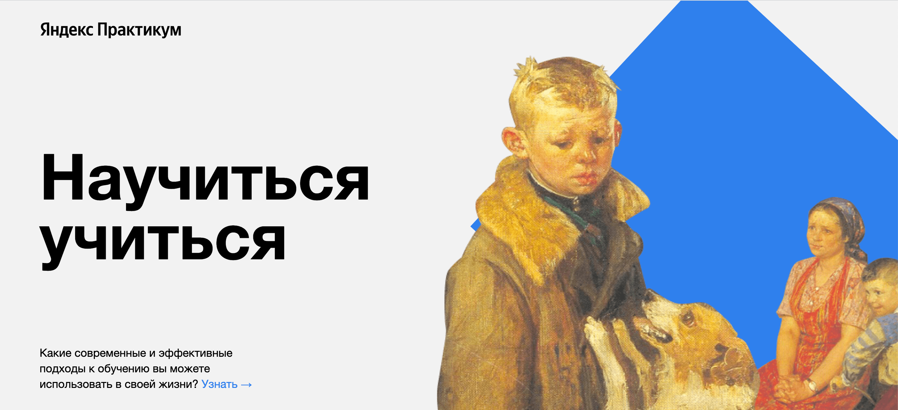

<h1 align="center">How To Learn project</h1>

     

  
Hi there, I'am Dmitrii. I'am a student Yandex Praktikum now.  
__How To Learn__ my first project on the way to WEB delveloper profession.  
This project contain next technologies:  
* HTML;
* CSS  

Development was carried out in accordance with the BEM standard and nested architecture CSS.  

